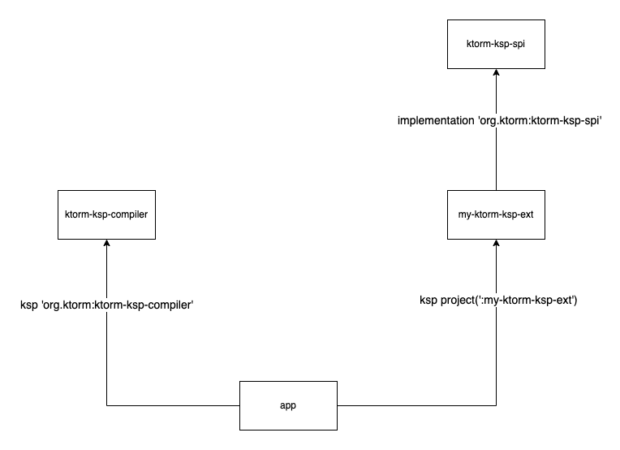

<p align="center">
    
</p>
<p align="center">
    <a href="https://github.com/kotlin-orm/ktorm-ksp/actions/workflows/build.yml">
        
    </a>
    <a href="https://search.maven.org/search?q=g:%22org.ktorm%22">
        
    </a>
    <a href="LICENSE">
        
    </a>
</p>

:us: English | :cn: [简体中文](README_cn.md)

# What's ktorm-ksp?

[Ktorm](https://github.com/kotlin-orm/ktorm) KSP extension to help generate boilerplate code. It can automatically
generate Table objects through entity classes, while making entities defined by data classes easier to use, and supports
custom extension code generation logic.

# Feature

- Just write the entity class and automatically generate the corresponding Table object. Support classes defined based
  on the Entity interface, as well as entities defined by ordinary class or data class

- Better support for class entity classes, the default implementation of the doCreateEntity method, and the add and
  update method of the entity sequence

- Generate ```constructor```, ```copy```, ```componentN``` functions for entities based on the Entity interface, 
making it as easy to use as a data class

- Extensible code generation logic. Through the SPI mechanism, you only need to implement the specified interface, and
  you can write your own automatically generated logic.

custom entity ▼

```kotlin
@Table
public data class Student(
    @PrimaryKey
    public var id: Int?,
    public var name: String,
    public var age: Int
)
```

Auto generate code ▼

```kotlin
public open class Students(
    alias: String? = null,
) : BaseTable<Student>(tableName = "Student", alias = alias, entityClass = Student::class) {
    public val id: Column<Int> = int("id").primaryKey()

    public val name: Column<String> = varchar("name")

    public val age: Column<Int> = int("age")

    public override fun aliased(alias: String): Students = Students(alias)

    public override fun doCreateEntity(row: QueryRowSet, withReferences: Boolean): Student {
        return Student(
            id = row[this.id],
            name = row[this.name]!!,
            age = row[this.age]!!,
        )
    }

    public companion object : Students()
}

public fun EntitySequence<Student, Students>.add(entity: Student, isDynamic: Boolean = false): Int { /*Ignore code*/
}

public fun EntitySequence<Student, Students>.update(entity: Student, isDynamic: Boolean = false): Int { /*Ignore code*/
}

public val Database.students: EntitySequence<Student, Students> get() = this.sequenceOf(Students)
```

> Why use class as a table type instead of an object singleton? Please refer to the documentation:  
[Self-Joining-amp-Table-Aliases](https://www.ktorm.org/en/joining.html#Self-Joining-amp-Table-Aliases)

Default generated code:

|                                 | Entities Based On The Entity Interface | Entities Of Any Kind Of Class |
|---------------------------------|----------------------------------------|-------------------------------|
| ```Table```type                 | ✅                                      | ✅                             |
| ```column```properteis          | ✅                                      | ✅ (unsupported references)    |
| ```doCreateEntity```function    |                                        | ✅                             |
| ```sequenceOf```扩展属性            | ✅                                      | ✅                             |
| ```EntitySequence.add``` 扩展方法   |                                        | ✅                             |
| ```EntitySequence.update```扩展方法 |                                        | ✅                             |
| 伪构造函数                           | ✅                                      |                               |
| ```entity.componentN```扩展方法     | ✅                                      |                               |
| ```entity.copy```扩展方法           | ✅                                      |                               |


- [Quick Start](#quick-start)
- [Define Entities](#define-entities)
    - [Define Entities Of Any Kind Of Class](#define-entities-of-any-kind-of-class)
    - [Define Entities Based On The Entity Interface](#define-entities-based-on-the-entity-interface)
    - [Define Table Schema](#define-table-schema)
    - [Define Primary Key](#define-primary-key)
    - [Define Table Column](#define-table-column)
    - [Ignore The Specified Properties](#ignore-the-specified-properties)
- [Global Configuration](#global-configuration)
- [Naming Style](#naming-style)
    - [Single Naming Configuration](#type-converter)
    - [Global Naming Configuration](#global-naming-configuration)
- [Type Converter](#type-converter)
    - [Use Type Converter in Column](#use-type-converter-in-column)
    - [Use Type Converter in Global Configuration](#use-type-converter-in-global-configuration)
- [Function And Property Generator](#function-and-property-generator)
    - [Steps To Customize The Generator](#steps-to-customize-the-generator)
    - [Available Generator Extensions](#available-generator-extensions)

### Quick Start

Add a dependency to ```build.gradle``` or ```pom.xml``` file:

```groovy
// groovy dsl gradle 
plugins {
    id 'com.google.devtools.ksp' version '1.6.21-1.0.5'
}

dependencies {
    implementation 'org.ktorm:ktorm-ksp-api:${ktorm_ksp.version}'
    ksp 'org.ktorm:ktorm-ksp-compiler:${ktorm_ksp.version}'
}
```

```kotlin
// kotlin dsl gradle
plugins {
    id("com.google.devtools.ksp").version("1.6.21-1.0.5")
}

dependencies {
    implementation("org.ktorm:ktorm-ksp-api:${ktorm_ksp.version}")
    ksp("org.ktorm:ktorm-ksp-compiler:${ktorm_ksp.version}")
}
```

```xml
<!-- maven -->
<project>
    <build>
        <plugins>
            <plugin>
                <groupId>org.jetbrains.kotlin</groupId>
                <artifactId>kotlin-maven-plugin</artifactId>
                <version>${kotlin.version}</version>
                <configuration>
                    <compilerPlugins>
                        <compilerPlugin>ksp</compilerPlugin>
                    </compilerPlugins>
                    <sourceDirs>
                        <sourceDir>src/main/kotlin</sourceDir>
                        <sourceDir>target/generated-sources/ksp</sourceDir>
                    </sourceDirs>
                </configuration>
                <dependencies>
                    <dependency>
                        <groupId>com.dyescape</groupId>
                        <artifactId>kotlin-maven-symbol-processing</artifactId>
                        <version>1.3</version>
                    </dependency>
                    <dependency>
                        <groupId>org.ktorm</groupId>
                        <artifactId>ktorm-ksp-compiler</artifactId>
                        <version>${ktorm_ksp.version}</version>
                    </dependency>
                </dependencies>
                <executions>
                    <execution>
                        <id>compile</id>
                        <phase>compile</phase>
                        <goals>
                            <goal>compile</goal>
                        </goals>
                    </execution>
                </executions>
            </plugin>
        </plugins>
    </build>

    <dependencies>
        <dependency>
            <groupId>org.ktorm</groupId>
            <artifactId>ktorm-ksp-api</artifactId>
            <version>${ktorm_ksp.version}</version>
        </dependency>
    </dependencies>
</project>
```

In order for idea to aware the generated code, you also need to add the following configuration to ```build.gradle```
(otherwise you will see some red line warnings). If you use maven, please ignore this step. Because the relevant
configuration has been added in the previous step.

```groovy
// Groovy DSL
kotlin {
    sourceSets {
        main.kotlin.srcDirs += 'build/generated/ksp/main/kotlin'
        test.kotlin.srcDirs += 'build/generated/ksp/test/kotlin'
    }
}
```

```kotlin
// Kotlin DSL
kotlin {
    sourceSets.main {
        kotlin.srcDir("build/generated/ksp/main/kotlin")
    }
    sourceSets.test {
        kotlin.srcDir("build/generated/ksp/test/kotlin")
    }
}
```

How to get ksp to generate code?

- Gradle: build project, running application, execute ```gradle build``` command. will generate code in
  ```build/generated/ksp/main/kotlin``` directory
- Maven: execute ```mvn kotlin:compile``` will generate code in ```target/generated-sources/ksp``` directory

### Define Entities

#### Define Entities Of Any Kind Of Class

```kotlin
@Table
public data class Student(
    @PrimaryKey
    public var id: Int?,
    public var name: String,
    public var age: Int
)
```

Generate code：

```kotlin
public open class Students(
    alias: String? = null,
) : BaseTable<Student>(tableName = "Student", alias = alias, entityClass = Student::class) {
    // Ignore code
}

public fun EntitySequence<Student, Students>.add(entity: Student, isDynamic: Boolean = false): Int { /*Ignore code*/
}
public fun EntitySequence<Student, Students>.update(entity: Student, isDynamic: Boolean = false): Int { /*Ignore code*/
}
public val Database.students: EntitySequence<Student, Students> get() = this.sequenceOf(Students)
```

The extended properties of Entity Sequence are generated by default, eliminating the need to manually write boilerplate
code for creating entity sequences.

```kotlin
val users = database.users.toList()
```

#### Define Entities Based On The Entity Interface

```kotlin
public open class Students(
    alias: String? = null,
) : Table<Student>(tableName = "Student", alias = alias, entityClass = Student::class) {
    // Ignore code
}

public val Database.students: EntitySequence<Student, Students> get() = this.sequenceOf(Students)

public fun Student(id: Int? = Undefined.of(), name: String? = Undefined.of(), age: Int? = Undefined.of()): Student {
  // Ignore code
}

public fun Student.copy(
  id: Int? = Undefined.of(),
  name: String? = Undefined.of(),
  age: Int? = Undefined.of()
): Student {
  // Ignore code
}

public operator fun Student.component1(): Int? = this.id
public operator fun Student.component2(): String = this.name
public operator fun Student.component3(): Int = this.age

```

The extended properties of ```EntitySequence``` are generated by default, which saves the steps of handwritten boilerplate code, 
and can be queried directly by calling

```kotlin
val users = database.users.toList()
```

#### Define Table Schema

Adding the @Table annotation to the entity class will automatically generate the corresponding Table class.

The parameters of @Table are as follows:


| Parameter          | Description                                                                                                                                          |
|--------------------|:-----------------------------------------------------------------------------------------------------------------------------------------------------|
| name               | Specify the parameter value of  ```BaseTable.tableName```                                                                                            |
| className          | Specifies the type name of the generated table type, which defaults to the plural form of the noun of the entity class                               |
| alias              | Specify the parameter value of  ```BaseTable.alias```                                                                                                |
| catalog            | Specify the parameter value of  ```BaseTable.catalog```                                                                                              |
| schema             | Specify the parameter value of  ```BaseTable.schema```                                                                                               |
| ignoreColumns      | Specifies a list of property names to ignore. The ignored properties will not generate corresponding column definitions in the generated Table class |
| entitySequenceName | The sequence name，By default, the first character lowercase of the tableClassName                                                                    |


#### Define Primary Key

Add the @Primary Key annotation to the entity class property to specify the property as the primary key.

#### Define Table Column

Add the @Column annotation to the entity class property to configure the generation options of the column definition.

The parameters of @Column are as follows:

| Parameter    | Description                                                                                      |
|--------------|:-------------------------------------------------------------------------------------------------|
| name         | Specify column names in SQL                                                                      |
| sqlType      | Specify [SqlType](#sqltype)                                                                      |
| propertyName | Specifies the property name of the corresponding column definition in the generated table class. |

#### Define Table Reference Column

If you need to use reference column, Just add the `````@References````` annotation to the referenced property. The entity class to 
which the annotation is added and the referenced entity class must both be ```Entities Based On The Entity Interface```.

The parameters of @References are as follows:

| Parameter    | Description                                                                                      |
|--------------|:-------------------------------------------------------------------------------------------------|
| name         | Specify column names in SQL                                                                      |
| propertyName | Specifies the property name of the corresponding column definition in the generated table class. |

When ```name``` is empty, the default generated ```column name``` is ```property name```+ ```reference table primary key property name```,
If a [NamingStyleStrategy](#naming-style) is configured, further conversions are performed.

```kotlin
@Table
public interface School : Entity<School> {
    @PrimaryKey
    public var id: Int
    public var name: String
}

@Table
public interface Student : Entity<Student> {
    @PrimaryKey
    public var id: Int

    @References
    public var school: School
}
```

Generated code:

```kotlin
public open class Students(alias: String?) : Table<Student>("Student", alias) {
    public val id: Column<Int> = int("id").primaryKey().bindTo { it.id }
    public val school: Column<Int> = int("schoolId").references(Schools) { it.school }

    // ...
}
```

#### Ignore The Specified Properties

Add the @Ignore annotation to the entity class property, and the generated table class will not contain the column
definition of this property. Properties to ignore can also be specified in the ignore Columns parameter in @Table.

### Global Configuration

Add the @KtormKspConfig annotation to any class for global configuration (this annotation can only be added once), and
the annotation parameters are as follows:

| Parameter                        | Description                                                                                                                                                                                                                                                                                                                                                                                                                                                                                                                                                   |
|----------------------------------|:--------------------------------------------------------------------------------------------------------------------------------------------------------------------------------------------------------------------------------------------------------------------------------------------------------------------------------------------------------------------------------------------------------------------------------------------------------------------------------------------------------------------------------------------------------------|
| allowReflectionCreateClassEntity | Whether to allow the creation of instance objects of ```entity of any kind class``` through reflection in the ```doCreateEntity``` method. If true, the instance will be created using reflection when the entity class constructor parameter has a default value parameter (reflection means a slight performance penalty, although in most cases this penalty is negligible). If it is false, the method will be directly constructed to create an instance, and the default value of the default value parameter in the construction will not take effect. |
| namingStrategy                   | Global naming style configuration. For the naming style, please refer to the description of the naming style below                                                                                                                                                                                                                                                                                                                                                                                                                                            |
| extension                        | Generation options for extension methods/properties. For specific extension descriptions, please refer to the related descriptions of method/property generators below                                                                                                                                                                                                                                                                                                                                                                                        |

```extension``` parameter description

- enableSequenceOf
  Whether to generate```EntitySequence```property extension. Generate code:
  ```kotlin 
  val Database.employees: EntitySequence<Employee,Employees>
  ```


- enableClassEntitySequenceAddFun
  Whether to generate```EntitySequence.add```method extension. This method is used to insert entity into the database. Generate code:
  ```kotlin
  fun EntitySequence<Employee,Employees>.add(employee: Employee)
  ```
  ```isDynamic```: if true, the generated SQL will include only the non-null columns.


- enableClassEntitySequenceUpdateFun
  Whether to generate```EntitySequence.update```method extension. This method is used to update the entity by primary key. Generate code:
  ```kotlin
  fun EntitySequence<Employee,Employees>.update(employee: Employee)
  ```
  ```isDynamic```: if true, the generated SQL will include only the non-null columns.


- enableInterfaceEntitySimulationDataClass
  Whether to generate```constuctor``` ```componentN``` ```copy```method. Generated only for ```entity class based on the Entity interface```. 
  The purpose is to make the entity class like```data class```, Generate code:
  ```kotlin
  public fun Employee(
    id: Int? = Undefined.of(),
    name: String? = Undefined.of(),
    job: String? = Undefined.of(),
  ): Employee
  
  public fun Employee.copy(
    id: Int? = Undefined.of(),
    name: String? = Undefined.of(),
    job: String? = Undefined.of(),
  ): Employee 
  
  public operator fun Employee.component1(): Int = this.id
  public operator fun Employee.component2(): String = this.name
  public operator fun Employee.component3(): String = this.job
  ```
  **Understand default argument:**```Undefined.of()```

  After creating an entity instance in ktorm, assigning null and unassigned values to the instance properties are two 
  substantially different behaviors. Example:
  ```kotlin
  val employee1 = Entity.create<Employee>()
  employee1.id = null
  database.employees.add(employee1)
  // SQL: insert into employee (id) values (null)
  val employee2 = Entity.create<Employee>()
  employee2.id = null
  employee2.name = null
  database.employees.add(employee2)
  // SQL: insert into employee (id, name) values (null, null)
  ```
  The generated SQL does not contain unassigned property.
  The constructor function and copy function generated by ksp have similar effects
  ```kotlin
  val employee = Employee(id = null)
  // The actual effect is equivalent to
  val employee = Entity.create<Employee>()
  employee.id = null
  // will not assign name property: employee.name = null
  ```
  When calling the function, the created entity instance will not assign the corresponding properties
  to the parameters that are not passed.
  In order to achieve this, the default argument value in the ```constructor``` and ```copy``` function may generate JDK dynamic
  proxy object, object that dynamically generates bytecode, object created by Unsafe（It depends on what the specific
  type is）This generated instance is unique and will not conflict with the parameters passed when calling
  （Unless you also call the ```Undefined.of()``` function to get the instance）Therefore, it can help us determine which
  parameters have passed values and which parameters have not passed values when calling the method.
  A limitation of this implementation is that the parameter type cannot be a non-null primitive type.
  This is because the non-null primitive type in kotlin will be automatically unboxed, which will cause our
  above implementation to fail, and there is no way to tell which parameter values were passed when calling.
  So in the generated ```constructor``` function, ```copy``` Function，If the property is a non-null primitive type,
  it is automatically converted to a nullable type. And in the process of actually creating the instance，
  Will judge whether the parameter value is null, if it is null, an exception will be thrown

### Naming Style

By default, the table name in the table class is generated, taking the entity class name. The column name takes the
property name in the corresponding entity class.

The generated name can be modified through ```Global Naming Configuration``` and ```Single Naming Configuration```.

#### Single Naming Configuration

Table name: assign the ```name``` parameter to the @Table annotation on the entity class

Column name: add the @Column annotation to the property and assign the ```name``` parameter

```kotlin
@Table(name = "t_student")
public interface Student : Entity<Student> {
    @PrimaryKey
    public var id: Int?

    @Column(name = "student_name")
    public var name: String
    public var age: Int
}
```

Generate code：

```kotlin
public open class Students(
    alias: String? = null,
) : Table<Student>(tableName = "t_student", alias = alias, entityClass = Student::class) {
    public val id: Column<Int> = int("id").bindTo { it.id }.primaryKey()
    public val name: Column<String> = varchar("student_name").bindTo { it.name }
    public val age: Column<Int> = int("age").bindTo { it.age }
    public override fun aliased(alias: String): Students = Students(alias)
    public companion object : Students()
}
```

Table and column names configured in this way have the highest priority and are not affected by
the ```Global Naming Configuration```.

#### Global Naming Configuration

Add @KtormKspConfig annotation configuration on any class (this annotation can only be added once) and assign
the ```namingStrategy``` parameter, this property requires a **singleton object** that implements the NamingStrategy
interface, In ktorm-ksp comes a camel case to snake case naming style strategy: ```CamelCaseToSnakeCaseNamingStrategy```

```kotlin
@KtormKspConfig(
    namingStrategy = CamelCaseToSnakeCaseNamingStrategy::class
)
public class KtormConfig

@Table
public interface Student : Entity<Student> {
    @PrimaryKey
    public var id: Int?
    public var firstName: String
    public var age: Int
}
```

Generate code：

```kotlin
public open class Students(
    alias: String? = null,
) : Table<Student>(tableName = "student", alias = alias, entityClass = Student::class) {
    public val id: Column<Int> = int("id").bindTo { it.id }.primaryKey()

    public val firstName: Column<String> = varchar("first_name").bindTo { it.firstName }

    public val age: Column<Int> = int("age").bindTo { it.age }

    public override fun aliased(alias: String): Students = Students(alias)

    public companion object : Students()
}
```

### SqlType

The data types supported by default in ktorm-ksp are as follows:

| kotlin Type             | Function Name | Underlying SQL Type | JDBC Type Code (java.sql.Types) |
|-------------------------|:-------------:|--------------------:|--------------------------------:|
| kotlin.Boolean          |    boolean    |             boolean |                   Types.BOOLEAN |
| kotlin.Int              |      int      |                 int |                   Types.INTEGER |
| kotlin.Short            |     short     |            smallint |                  Types.SMALLINT |
| kotlin.Long             |     long      |              bigint |                    Types.BIGINT |
| kotlin.Float            |     float     |               float |                     Types.FLOAT |
| kotlin.Double           |    double     |              double |                    Types.DOUBLE |
| kotlin.BigDecimal       |    decimal    |             decimal |                   Types.DECIMAL |
| kotlin.String           |    varchar    |             varchar |                   Types.VARCHAR |
| java.sql.Date           |   jdbcDate    |                date |                      Types.DATE |
| java.sql.Time           |   jdbcTime    |                time |                      Types.TIME |
| java.sql.Timestamp      | jdbcTimestamp |           timestamp |                 Types.TIMESTAMP |
| java.time.LocalDateTime |   datetime    |            datetime |                 Types.TIMESTAMP |
| java.time.LocalDate     |     date      |                date |                      Types.DATE |
| java.time.LocalTime     |     time      |                time |                      Types.TIME |
| java.time.MonthDay      |   monthDay    |             varchar |                   Types.VARCHAR |
| java.time.YearMonth     |   yearMonth   |             varchar |                   Types.VARCHAR |
| java.time.Year          |     year      |                 int |                   Types.INTEGER |
| java.time.Instant       |   timestamp   |           timestamp |                 Types.TIMESTAMP |
| java.util.UUID          |     uuid      |                uuid |                     Types.OTHER |
| kotlin.ByteArray        |     bytes     |               bytes |                    Types.BINARY |
| kotlin.Enum             |     enum      |                enum |                   Types.VARCHAR |

If you need to use a type not listed above, or want to override the default type behavior,
The ```sql Type``` parameter needs to be assigned in the ```@Column``` annotation, argument must be a type that 
implements ```SqlType``` or ```SqlTypeFactory```, and this type must be ```singleton```.

- SqlType
  适用于明确某一个kotlin类型, 如Int、String. 更多信息请参考[文档](https://www.ktorm.org/zh-cn/schema-definition.html#SqlType)
- SqlTypeFactory
  接收字段的信息返回```SqlType```实例, 适用于不明确kotlin类型, 如json类型

Example:

```kotlin
@Table
public data class Student(
    @PrimaryKey
    public var id: Int?,
    @Column(sqlType = UIntSqlType::class)
    public var age: UInt,
    @Column(sqlType = IntEnumSqlTypeFactory::class)
    public var gender: Gender
)

public object UIntSqlType : SqlType<UInt>(Types.INTEGER, "int") {
    override fun doSetParameter(ps: PreparedStatement, index: Int, parameter: UInt) {
        ps.setLong(index, parameter.toLong())
    }
    override fun doGetResult(rs: ResultSet, index: Int): UInt {
        return rs.getLong(index).toUInt()
    }
}

public object IntEnumSqlTypeFactory : SqlTypeFactory {
    @Suppress("UNCHECKED_CAST")
    override fun <T : Any> createSqlType(property: KProperty1<*, T?>): SqlType<T> {
        val returnType = property.returnType.jvmErasure.java
        if (returnType.isEnum) {
            return IntEnumSqlType(returnType as Class<out Enum<*>>) as SqlType<T>
        } else {
            throw IllegalArgumentException("The property is required to be typed of enum but actually: $returnType")
        }
    }

    private class IntEnumSqlType<E : Enum<E>>(val enumClass: Class<E>) : SqlType<E>(Types.INTEGER, "int") {
        override fun doSetParameter(ps: PreparedStatement, index: Int, parameter: E) {
            ps.setInt(index, parameter.ordinal)
        }
        override fun doGetResult(rs: ResultSet, index: Int): E? {
            return enumClass.enumConstants[rs.getInt(index)]
        }
    }
}
```

Generated code:

```kotlin
public open class Students(alias: String?) : BaseTable<Student>("student", alias) {
    public val id: Column<Int> = int("id").primaryKey()
    public val age: Column<UInt> = registerColumn("age", UIntSqlType)
    public val gender: Column<Gender> = registerColumn("gender", IntEnumSqlTypeFactory.createSqlType(Student::gender))
    // ...
}
```

### Function And Property Generator

The table class code generated by ktorm-ksp is generated by multiple code generators, and these generators are all
customizable and extensible.

- TableTypeGenerator

  The table type declaration generator, only one is allowed, and the custom implementation will override the default
  implementation.

- TablePropertyGenerator

  The table class property declaration generator, only one is allowed, and the custom implementation will override the
  default implementation.

- TableFunctionGenerator

  The table class function generator, only one is allowed, and the custom implementation will override the default
  implementation.

- TopLevelPropertyGenerator

  Top-level property generator, generally used to generate extended property, multiple are allowed.

- TopLevelFunctionGenerator

  Top-level function generator, generally used to generate extension function, multiple are allowed.

#### Principles of custom generators

ktorm-ksp implements the custom extension of the generator through
the [SPI](https://docs.oracle.com/javase/tutorial/sound/SPI-intro.html) mechanism. The module dependencies are as
follows (simplified):



The ```ktorm-ksp-compiler``` module automatically loads the generator defined in ```my-ktorm-ksp-ext``` through SPI, and
uses it to participate in ```code generator```, to achieve the purpose of custom generator.

#### Steps To Customize The Generator

Please refer to project [ktorm-ksp-ext-batch](https://github.com/kotlin-orm/ktorm-ksp-ext-batch)

Create a new module that implements the generator (corresponding to ```my-ktorm-ksp-ext``` in the above figure), and add
dependencies in ```build.gradle``` or ```pom.xml```

```groovy
// groovy dsl gradle 
dependencies {
    implementation 'org.ktorm:ktorm-ksp-spi:${ktorm_ksp.version}'
}
```

```kotlin
// kotlin dsl gradle
dependencies {
    implementation("org.ktorm:ktorm-ksp-codegen:${ktorm_ksp.version}")
}
```

```xml
<!-- maven -->
<dependencies>
    <dependency>
        <groupId>org.ktorm</groupId>
        <artifactId>ktorm-ksp-spi</artifactId>
        <version>${ktorm_ksp.version}</version>
    </dependency>
</dependencies>
```

Create a new generator class that implements any generator interface.

```kotlin
public class SequenceAddAllFunctionGenerator : TopLevelFunctionGenerator {
    // Ignore code
}
public class SequenceUpdateAllFunctionGenerator : TopLevelFunctionGenerator {
    // Ignore code
}
```

Create a new file in the ```resources/META-INF/services``` directory, the file name is the fully qualified class name of
the generator interface (org.ktorm.ksp.spi.TopLevelFunctionGenerator), and add the fully qualified class name of the
custom generator in the file. name, and multiple classes are separated by newlines.

```
org.ktorm.ksp.ext.SequenceAddAllFunctionGenerator
org.ktorm.ksp.ext.SequenceUpdateAllFunctionGenerator
```

Add the ```my-ktorm-ksp-ext``` to the modules that need to generate code with it (corresponding to ```app```
in the above figure)

```groovy
// groovy dsl gradle 
dependencies {
    implementation 'org.ktorm:ktorm-ksp-api:${ktorm_ksp.version}'
    ksp 'org.ktorm:ktorm-ksp-compiler:${ktorm_ksp.version}'
    ksp project(':my-ktorm-ksp-ext')
}
```

```kotlin
// kotlin dsl gradle
dependencies {
    implementation("org.ktorm:ktorm-ksp-api:${ktorm_ksp.version}")
    ksp("org.ktorm:ktorm-ksp-compiler:${ktorm_ksp.version}")
    ksp(project(":my-ktorm-ksp-ext"))
}
```

```xml
<!-- maven -->
<plugin>
    <groupId>org.jetbrains.kotlin</groupId>
    <artifactId>kotlin-maven-plugin</artifactId>
    <version>${kotlin.version}</version>
    <configuration>
        <compilerPlugins>
            <compilerPlugin>ksp</compilerPlugin>
        </compilerPlugins>
        <sourceDirs>
            <sourceDir>src/main/kotlin</sourceDir>
            <sourceDir>target/generated-sources/ksp</sourceDir>
        </sourceDirs>
    </configuration>
    <dependencies>
        <dependency>
            <groupId>com.dyescape</groupId>
            <artifactId>kotlin-maven-symbol-processing</artifactId>
            <version>1.3</version>
        </dependency>
        <dependency>
            <groupId>org.ktorm</groupId>
            <artifactId>ktorm-ksp-compiler</artifactId>
            <version>${ktorm_ksp.version}</version>
        </dependency>
        <dependency>
          <groupId><!-- my-ktorm-ksp-ext groupId --></groupId>
          <artifactId><!-- my-ktorm-ksp-ext artifactId --></artifactId>
          <version><!-- my-ktorm-ksp-ext version --></version>
        </dependency>
    </dependencies>
    <executions>
        <execution>
            <id>compile</id>
            <phase>compile</phase>
            <goals>
                <goal>compile</goal>
            </goals>
        </execution>
    </executions>
</plugin>
```

Let ksp generate the code again. You will see the code generated by the custom generator.

#### Available Generator Extensions

- [ktorm-ksp-ext-batch](https://github.com/kotlin-orm/ktorm-ksp-ext-batch)

