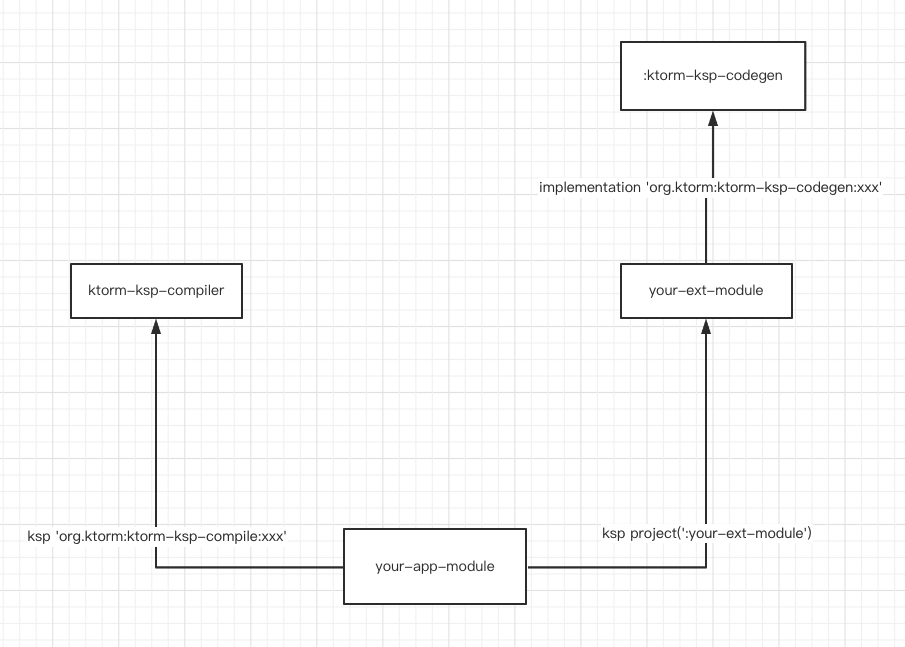

<p align="center">
    
</p>

:us: [English](README.md) | :cn: 简体中文

# ktorm-ksp是什么？

帮助[Ktorm](https://github.com/kotlin-orm/ktorm) 生成样板代码的KSP扩展. 它可以通过实体类自动生成Table对象，同时让data class定义的实体更加好用，支持自定义扩展代码生成逻辑。

- 注意： 该项目还在进行开发中

# 特性

- 只需编写实体类，自动生成相应的Table对象。支持基于Entity接口/[任意类](https://www.ktorm.org/zh-cn/define-entities-as-any-kind-of-classes.html) 定义的实体类

- 让[任意类](https://www.ktorm.org/zh-cn/define-entities-as-any-kind-of-classes.html) 实体类更好用。默认自动实现doCreateEntity方法，以及实体序列的新增/更新方法

- 可扩展的代码生成逻辑。通过SPI机制，只需实现指定的接口，即可编写自己所需的自动生成逻辑。

定义实体 ▼

```kotlin
@Table
public data class Student(
    @PrimaryKey
    public var id: Int?,
    public var name: String,
    public var age: Int
)
```

自动生成代码 ▼

```kotlin
public object Students : BaseTable<Student>(tableName = "Student", entityClass = Student::class,) {
    public val id: Column<Int> = int("id").primaryKey()

    public val name: Column<String> = varchar("name")

    public val age: Column<Int> = int("age")

    public override fun doCreateEntity(row: QueryRowSet, withReferences: Boolean): Student {
        return Student(
            id = row[id],
            name = row[name]!!,
            age = row[age]!!,
        )
    }
}

public fun EntitySequence<Student, Students>.add(entity: Student): Int { /*此处省略具体实现*/
}

public fun EntitySequence<Student, Students>.update(entity: Student): Int { /*此处省略具体实现*/
}

public val Database.students: EntitySequence<Student, Students> get() = this.sequenceOf(Students)
```

- [快速入门](#快速入门)
- [实体定义](#实体定义)
  - [任意类的实体类定义](#任意类的实体类定义)
  - [基于Entity接口的实体类定义](#基于Entity接口的实体类定义)
  - [表定义](#表定义)
  - [主键定义](#主键定义)
  - [列定义](#列定义)
  - [忽略指定属性](#忽略指定属性)
- [全局配置](#全局配置)
- [命名风格](#命名风格)
  - [命名单独配置](#命名单独配置)
  - [全局命名风格配置](#全局命名风格配置)
- [类型转换器](#类型转换器)
  - [列配置使用类型转换器](#列配置使用类型转换器)
  - [全局配置使用类型转换器](#全局配置使用类型转换器)
- [方法/属性生成器](#方法/属性生成器)
  - [自定义生成器的步骤](#自定义生成器的步骤)
  - [可用的生成器扩展](#可用的生成器扩展)

### 快速入门

在build.gradle中添加依赖

```groovy
plugins {
    id 'com.google.devtools.ksp' version '1.6.21-1.0.5'
}

dependencies {
    implementation 'org.ktorm:ktorm-ksp-api:${ktorm-ksp.version}'
    ksp 'org.ktorm:ktorm-ksp-compiler:${ktorm-ksp.version}'
}
```

为了让idea识别生成的代码 还需要在build.gradle中添加以下配置（否则你将会看到一堆红线警告）

```groovy
kotlin {
    sourceSets {    
        main.kotlin.srcDirs += 'build/generated/ksp/main/kotlin'
        test.kotlin.srcDirs += 'build/generated/ksp/test/kotlin'
    }
}
```

### 实体定义

#### 任意类的实体类定义

```kotlin
@Table
public data class Student(
    @PrimaryKey
    public var id: Int?,
    public var name: String,
    public var age: Int
)
```

运行项目或者gradle build命令, 将会在项目下的 build/generated/ksp/main/kotlin 生成相应的BaseTable类以及相关扩展

```kotlin
public object Students : BaseTable<Student>(tableName = "Student", entityClass = Student::class) {
    // 此处省略具体实现
}

public fun EntitySequence<Student, Students>.add(entity: Student): Int { /*此处省略具体实现*/
}
public fun EntitySequence<Student, Students>.update(entity: Student): Int { /*此处省略具体实现*/
}
public val Database.students: EntitySequence<Student, Students> get() = this.sequenceOf(Students)
```

默认生成了EntitySequence的扩展属性，省去了手写样板代码的步骤，直接调用即可查询

```kotlin
val users = database.users.toList()
```

#### 基于Entity接口的实体类定义

```kotlin
@Table
public interface Student : Entity<Student> {
    @PrimaryKey
    public var id: Int?
    public var name: String
    public var age: Int
}
```

运行项目或者gradle build命令, 将会在项目下的 build/generated/ksp/main/kotlin 生成表定义以及相关的扩展，下面是生成的代码

```kotlin
public object Students : Table<Student>(tableName = "Student", entityClass = Student::class) {
    // 此处省略具体实现
}

public val Database.students: EntitySequence<Student, Students> get() = this.sequenceOf(Students)
```

与entity实体生成的表不同的地方在于，表继承了Table类而不是BaseTable类，因此无需实现doCreateEntity方法. 也因此无需生成EntitySequence的add update扩展方法（因为已经存在了）

```kotlin
val users = database.users.toList()
```
#### 表定义

将@Table注解添加到实体类上，将会自动生成相应的Table类。

@Table的参数如下：

| 参数            |   说明   
|----------|:----------:|
tableName | 指定BaseTable.tableName的参数值
tableClassName | 指定生成表类型的类型名称，默认取实体类的名词复数形式
alias | 指定BaseTable.alias的参数值
catalog | 指定BaseTable.catalog的参数值
schema | 指定BaseTable.schema的参数值
ignoreColumns | 指定要忽略的属性名称列表，被忽略的属性将不会在生成的Table类中，生成对应的列定义

#### 主键定义

在实体类属性添加@PrimaryKey注解，指定属性为主键。

#### 列定义

在实体类属性添加@Column注解，可配置列定义的生成选项。

@Column的参数如下：

| 参数            |   说明
|----------|:----------:|
columnName | 指定SQL中的列名
converter | 指定列转换器，关于转换器请参考文档下方中的类型转换器说明
propertyName | 指定在生成表类中，对应列定义的属性名称。
isReferences | 指定此属性是否为引用列，只有基于Entity接口的实体类，可以赋值为true。当此值为true时，生成的列定义将会自动调用references方法

#### 忽略指定属性 

在实体类属性添加@Ignore注解，生成的表类中不会包含此属性的列定义。也可以在@Table中的ignoreColumns参数指定要忽略的属性。

### 全局配置

在```任意类的实体类```上添加@KtormKspConfig注解，可以进行全局配置（只能添加一次此注解），注解参数如下

| 参数            |   说明
|----------|:----------:|
allowReflectionCreateClassEntity | 是否允许在doCreateEntity方法中通过反射创建```任意类的实体类```的实例对象。如果为true，那么当实体类构造参数存在默认值参数时，会使用反射进行创建实例 （反射意味着带来了轻微的性能损耗，尽管大部分情况下这个损耗可以忽略不计）。如果如果为false，那么会直接构造方法创建实例，构造中的默认值参数的默认值，将无法生效
enumConverter | 全局枚举转换器，实体类中的枚举类型属性会自动使用该转换器。关于转换器请参考下文类型转换器的说明
singleTypeConverters | 全局单类型转换器，实体类中的对应类型的属性会自动使用该转换器。关于转换器请参考下文类型转换器的说明
namingStrategy | 全局命名风格配置。关于命名风格请参考下文命名风格的说明
extension | 扩展方法/属性的生成选项（具体的扩展说明请参考下文方法/属性生成器的相关说明）

extension参数说明

| 参数            |   说明
|----------|:----------:|
enableSequenceOf | 是否生成实体序列扩展
enableClassEntitySequenceAddFun | 是否生成实体序列添加方法扩展
enableClassEntitySequenceUpdateFun | 是否生成实体序列更新方法扩展

### 命名风格

在默认情况下，生成表类中的表名，取实体类类名。列名取对应实体类中的属性名称。 

可以通过全局配置、单独配置修改生成的名称。

#### 命名单独配置

表名配置：在实体类上的@Table注解中赋值tableName参数

列名配置：在属性上添加@Column注解并赋值columnName参数

```kotlin
@Table(tableName = "t_student")
public interface Student : Entity<Student> {
    @PrimaryKey
    public var id: Int?

    @Column(columnName = "student_name")
    public var name: String
    public var age: Int
}
```

生成代码：

```kotlin
public object Students : Table<Student>(tableName = "t_student", entityClass = Student::class) {
    public val id: Column<Int> = int("id").bindTo { it.id }.primaryKey()
    public val name: Column<String> = varchar("student_name").bindTo { it.name }
    public val age: Column<Int> = int("age").bindTo { it.age }
}
```

通过这种方式配置的表名/列名拥有最高优先级，不受全局命名风格配置影响。

#### 全局命名风格配置

在任意类上添加@KtormKspConfig注解配置（注意项目中只能声明一次此注解）并赋值namingStrategy参数，此属性需要一个实现NamingStrategy接口的**单例对象**,
在ktorm-ksp中自带了驼峰转小写下划线风格的命名风格策略： CamelCaseToLowerCaseUnderscoresNamingStrategy

```kotlin
@KtormKspConfig(
    namingStrategy = CamelCaseToLowerCaseUnderscoresNamingStrategy::class
)
public class KtormConfig

@Table
public interface Student : Entity<Student> {
    @PrimaryKey
    public var id: Int?
    public var name: String
    public var age: Int
}
```

生成代码：

```kotlin
public object StudentProfiles :
    Table<StudentProfile>(tableName = "student_profile", entityClass = StudentProfile::class) {
    public val id: Column<Int> = int("id").bindTo { it.id }.primaryKey()
    public val firstName: Column<String> = varchar("first_name").bindTo { it.firstName }
    public val lastName: Column<String> = varchar("last_name").bindTo { it.lastName }
    public val telephoneNumber: Column<String> =
        varchar("telephone_number").bindTo { it.telephoneNumber }
}
```

### 类型转换器

在ktorm-ksp中默认支持的数据类型如下

| kotlin类型 | 函数名 | 底层SQL类型 | JDBC 类型码 (java.sql.Types)
|---------|:-------------:|------:|------:|
kotlin.Boolean  | boolean | boolean | Types.BOOLEAN
kotlin.Int  | int | int | Types.INTEGER
kotlin.Short  | short | smallint | Types.SMALLINT
kotlin.Long  | long | bigint | Types.BIGINT
kotlin.Float  | float | float | Types.FLOAT
kotlin.Double  | double | double | Types.DOUBLE
kotlin.BigDecimal  | decimal | decimal | Types.DECIMAL
kotlin.String  | varchar | varchar | Types.VARCHAR
java.sql.Date  | jdbcDate | date | Types.DATE
java.sql.Time  | jdbcTime | time | Types.TIME
java.sql.Timestamp  | jdbcTimestamp | timestamp | Types.TIMESTAMP
java.time.LocalDateTime  | datetime | datetime | Types.TIMESTAMP
java.time.LocalDate  | date | date | Types.DATE
java.time.LocalTime  | time | time | Types.TIME
java.time.MonthDay  | monthDay | varchar | Types.VARCHAR
java.time.YearMonth  | yearMonth | varchar | Types.VARCHAR
java.time.Year  | year | int | Types.INTEGER
java.time.Instant  | timestamp | timestamp | Types.TIMESTAMP
java.util.UUID  | uuid | uuid | Types.OTHER
kotlin.ByteArray  | bytes | bytes | Types.BINARY
kotlin.Enum  | enum | enum | Types.VARCHAR

如果需要使用不在上述的类型，或者想覆盖默认的类型行为，则需要使用到类型转换器

类型转换器有以下三种（对应三个接口)

- SingleTypeConverter

  仅支持某一个类型的转换器，可用于全局配置或者指定列配置

- MultiTypeConverter

  支持任意类型的转换器，适合使用将对象转换成json存储到数据库中的使用场景, 只能用于指定列配置

- EnumConverter

  支持任意枚举类型的转换器，可用于全局配置或者指定列配置

#### 如何使用类型转换器

首先需要定义一个单例，并且实现上述任意一个转换器类型接口。 然后可以通过'全局配置'或者'列配置'使用类型转换器，转换器的优先级如下:

列配置 > 全局配置 > 默认的类型转换行为

##### 列配置使用类型转换器

通过@Column中的converter属性，可以使用任意类型的转换器.

```kotlin
//实体定义
@Table
data class User(
    @PrimaryKey
    var id: Int,
    @Column(converter = UsernameConverter::class)
    var username: Username,
    var age: Int,
    @Column(converter = IntEnumConverter::class)
    var gender: Gender
)

enum class Gender {
    MALE,
    FEMALE
}

data class Username(
    val firstName: String,
    val lastName: String
)

//类型转换器
object UsernameConverter : SingleTypeConverter<Username> {
    public override fun convert(
        table: BaseTable<*>,
        columnName: String,
        propertyType: KClass<Username>
    ): Column<Username> {
        return with(table) {
            varchar(columnName).transform({
                val spilt = it.split("#")
                Username(spilt[0], spilt[1])
            }, {
                it.firstName + "#" + it.lastName
            })
        }
    }
}

object IntEnumConverter : EnumConverter {
    override fun <E : Enum<E>> convert(table: BaseTable<*>, columnName: String, propertyType: KClass<E>): Column<E> {
        val values = propertyType.java.enumConstants
        return with(table) {
            int(columnName).transform({ values[it] }, { it.ordinal })
        }
    }
}
```

生成代码

```kotlin
public object Users : BaseTable<User>(tableName = "User", entityClass = User::class) {
    public val id: Column<Int> = int("id").primaryKey()
    public val username: Column<Username> = UsernameConverter.convert(this, "username", Username::class)
    public val age: Column<Int> = int("age")
    public val gender: Column<Gender> = IntEnumConverter.convert(this, "gender", Gender::class)
    // ...
}
```

##### 全局配置使用类型转换器

类型转换器可以添加到全局配置@KtormKspConfig中的singleTypeConverters和enumConverter参数

- singleTypeConverters: 接收SingleTypeConverter的类型数组，当有SingleTypeConverter支持类型的属性时，会自动使用对应的转换器

- enumConverter: 接收一个EnumConverter的类型，所有的枚举类型会自动使用该转换器。

```kotlin
@Table
data class User(
    @PrimaryKey
    var id: Int,
    var username: Username,
    var age: Int,
    var gender: Gender
)

data class Username(
    val firstName: String,
    val lastName: String
)

@KtormKspConfig(
  singleTypeConverters = [UsernameConverter::class],
  enumConverter = IntEnumConverter::class
)
class KtormConfig

object UsernameConverter : SingleTypeConverter<Username> {
    public override fun convert(
        table: BaseTable<*>,
        columnName: String,
        propertyType: KClass<Username>
    ): Column<Username> {
        return with(table) {
            varchar(columnName).transform({
                val spilt = it.split("#")
                Username(spilt[0], spilt[1])
            }, {
                it.firstName + "#" + it.lastName
            })
        }
    }
}

object IntEnumConverter : EnumConverter {
  override fun <E : Enum<E>> convert(table: BaseTable<*>, columnName: String, propertyType: KClass<E>): Column<E> {
    val values = propertyType.java.enumConstants
    return with(table) {
      int(columnName).transform({ values[it] }, { it.ordinal })
    }
  }
}
```

生成代码：

```kotlin
public object Users : BaseTable<User>(tableName = "User", entityClass = User::class) {
    public val id: Column<Int> = int("id").primaryKey()
    public val username: Column<Username> = UsernameConverter.convert(this, "username", Username::class)
    public val age: Column<Int> = int("age")
    public val gender: Column<Gender> = IntEnumConverter.convert(this, "gender", Gender::class)
    // ...
}
```

### 方法/属性生成器

ktorm-ksp生成的表类代码由多个代码生成器进行生成，这些生成器都是可自定义扩展的。
 
- 表类型生成器 TableTypeGenerator

  表类型声明生成，只允许存在一个，自定义实现会覆盖默认实现。
 
- 表属性生成器 TablePropertyGenerator

  表类属性声明生成，只允许存在一个，自定义实现会覆盖默认实现。

- 表方法生成器 TableFunctionGenerator

  表类方法生成，只允许存在一个，自定义实现会覆盖默认实现。
 
- 顶级属性生成器 TopLevelPropertyGenerator
  
  顶级属性生成，一般用于生成扩展属性，允许存在多个。

- 顶级方法生成器 TopLevelFunctionGenerator
  
  顶级方法生成，一般用于生成扩展方法，允许存在多个。

#### 自定义生成器原理

ktorm-ksp通过[SPI](https://docs.oracle.com/javase/tutorial/sound/SPI-intro.html) 机制实现生成器的自定义扩展，模块依赖关系如下（经过简化）：



ktorm-ksp-compiler模块通过SPI自动加载your-ext-module中定义的生成器，并使用它参与生成代码，从而达到自定义生成器的目的。

#### 自定义生成器的步骤

（请参考此[模块](ktorm-ksp-ext/ktorm-ksp-ext-sequence-batch) 的代码实现）

新建实现生成器的module（对应上图中的your-ext-module），在build.gradle.kts添加依赖
```groovy
dependencies {
  implementation 'org.ktorm:ktorm-ksp-codegen:${ktorm-ksp.version}'
}
```
新建生成器类，实现任意一个生成器接口。
```kotlin
public class SequenceAddAllFunctionGenerator : TopLevelFunctionGenerator {
    // 忽略具体实现
}
public class SequenceUpdateAllFunctionGenerator : TopLevelFunctionGenerator {
    // 忽略具体实现
}
```
在resources/META-INF/services目录下新建文件，文件名为生成器接口的全限定类名（org.ktorm.ksp.codegen.TopLevelFunctionGenerator）并中文件中新增自定义的生成器的全限定类名，多个类以换行分割。
```
org.ktorm.ksp.ext.SequenceAddAllFunctionGenerator
org.ktorm.ksp.ext.SequenceUpdateAllFunctionGenerator
```
在使用需要生成代码的模块（对应上图中的your-app-module）中，添加以下依赖
```groovy
dependencies {
  implementation 'org.ktorm:ktorm-ksp-api:${ktorm-ksp.version}'
  ksp 'org.ktorm:ktorm-ksp-compile:${ktorm-ksp.version}'
  ksp project(':your-ext-module')
}
```
构建项目，你将看到通过自定义生成器生成的代码。

#### 可用的生成器扩展

- [ktorm-ksp-ext-sequence-batch](ktorm-ksp-ext/ktorm-ksp-ext-sequence-batch)

针对```任意类的实体类```实体序列生成批量添加，批量更新的方法。依赖：

```groovy
ksp 'org.ktorm:ktorm-ksp-ext-sequence-batch:${ktorm-ksp.version}'
```

生成以下扩展方法:

```kotlin
/**
 * 批量插入实体到数据库, 此方法不会获取自增主键
 * @param entities 要插入的实体列表 
 * @return 每个子操作影响的行数
 */
public fun EntitySequence<Customer, Customers>.addAll(entities: Iterable<Customer>): IntArray =
  this.database.batchInsert(Customers) {
    for (entity in entities) {
      item {
        set(Customers.id, entity.id)
        set(Customers.name, entity.name)
        set(Customers.email, entity.email)
        set(Customers.phoneNumber, entity.phoneNumber)
      }
    }
  }

/**
 * 根据实体主键批量更新
 * @param entities 要更新的实体列表
 * @return 每个子操作影响的行数
 */
public fun EntitySequence<Customer, Customers>.updateAll(entities: Iterable<Customer>): IntArray =
  this.database.batchUpdate(Customers) {
    for (entity in entities) {
      item {
        set(Customers.name, entity.name)
        set(Customers.email, entity.email)
        set(Customers.phoneNumber, entity.phoneNumber)
        where {
          it.id eq entity.id!!
        }
      }
    }
  }
```
